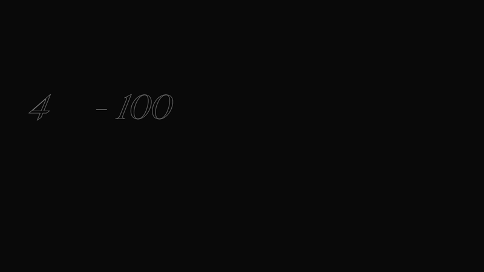

# OBYS ✨

**OBYS** is a detailed and visually striking front-end replica inspired by [Obys.agency](https://obys.agency), created entirely from scratch using HTML, CSS, and JavaScript. This project showcases a complete custom design built to learn and mirror professional agency-level layout, animation, and responsiveness. It features advanced scroll-based interactions, layered visuals, smooth transitions, and responsive elements—all implemented manually without frameworks.

🔗 [Live Project](https://obys999.netlify.app/)

---

## Preview



---

## 🛠️ Tech Stack

* **HTML5** – Structured markup inspired by semantic standards
* **CSS3** – Extensive use of Flexbox and Grid for layout with media queries for responsiveness
* **JavaScript (Vanilla)** – DOM manipulation and interactivity
* **GSAP + ScrollTrigger** – Seamless animations on scroll, timed transitions, and element reveals

## 🎯 Key Features

* Full-page scroll animations mimicking real agency-level transitions
* Clean navigation UI with hover-based effects and page section highlighting
* Hero section with fixed elements and overlay animation
* Multi-section layout inspired by a real-world design studio
* Consistent dark theme styling and font hierarchy
* Preloader animation to enhance the first impression
* Optimized for responsiveness across devices

## 🧠 What I Learned

* How to deconstruct professional agency designs and rebuild them from scratch
* Implementing fine-tuned GSAP scroll animations including pinning, reveal, and sequencing
* Designing for responsiveness across breakpoints using Grid and Flexbox
* Layering content effectively using z-index, overflow, and positioning
* Building scalable, modular CSS architecture and animation timelines

---

## Whole project preview


---

## 📁 Project Structure

```bash
OBYS/
├── index.html              # Main HTML structure
├── css/
│   └── style.css           # Complete styling
├── js/
│   └── script.js           # All interactive features and animations
├── assets/                 # All images, SVGs, and fonts
└── README.md               # Project documentation
```


## 🚀 Future Improvements

* Add light/dark theme toggle
* Include live page transition between multiple HTML files
* Use Locomotive Scroll or SmoothScroller for enhanced smooth scroll experience
* Build a React version using GSAP + Framer Motion
* Explore A11y and keyboard navigation enhancements

## 👨‍💻 Author

**Harekrishna Manna**
Frontend Developer (React Learner) | Based in Mumbai
Currently learning React and aiming for full stack (MERN)
Connect with me on [LinkedIn](https://www.linkedin.com/in/harekrishna-manna-22569736b/)


---

## 💌 Contact

If you'd like to collaborate or hire me for internships, drop a message at:
📧 [swimkrihna150@gmail.com](mailto:swimkrihna150@gmail.com)

---

⭐️ *Give this repo a star if you liked the UI, animations, or structure!*
